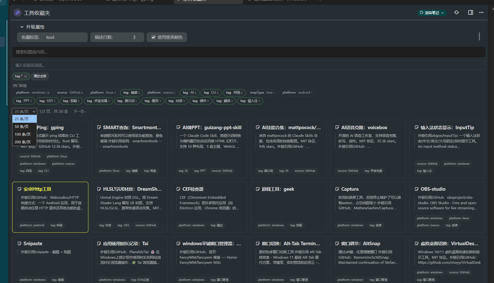

<!-- This is the English version. Chinese version available at readme_zh.md -->

> 📖 This document is in English. 中文版本: [readme_zh.md](readme_zh.md).

# Favourites Panel — Trilium Favourites Management

## Overview

Trilium has a built-in bookmark system, but there's no visual panel to browse all bookmarked/favourited notes at a glance. Manually navigating through the note tree to find favourited notes is tedious.

This plugin adds a **Favourites Panel** to Trilium's frontend showcase page. It collects notes with a configurable label (default `#favourite`) and displays them as a **card grid** view, with the following features:

- **Card Layout** — Each note is shown as a card with title (bold), description (blockquote), and tags (pills)
- **Advanced Tag Filter** — Two-level tag selection: click tag name to filter by that label (any value), or click tag value for exact match. Selected tags shown in a removable bar
- **Text Search** — Combined with tag filters, searched on backend with pagination
- **Pagination** — Page size selector (25/50/100/200), prev/next navigation
- **Tags Scoped to Collection** — Only tags from notes within the current `#favLabel` collection are shown
- **Custom Icon** — Card title icon uses the note's own `#iconClass` (Box Icons), defaults to `bx bx-note`
- **Color Accent** — Cards with a `#color` label use that color for the border and title text
- **Responsive Grid** — Cards auto-arrange and wrap based on page width
- **Theme Aware** — Styling follows Trilium's theme using CSS variables



## Installation

### Option 1: Manual File Copy

1. Open the note `nlKR1j0QzfmS` (Frontend Showcase) in Trilium
2. Create the following structure under that note:

```
Favourites Panel (render type)
  └── ~renderNote → html (code, mime: text/html)
                      └── js (code, mime: application/javascript;env=frontend)
```

3. Copy the contents of `html模板.html` into the **html** note
4. Copy the contents of `js逻辑.js` into the **js** note
5. Set the `~renderNote` relation on the **Favourites Panel** note pointing to the **html** note
6. (Optional) Add relevant promoted attributes (see Configuration below)

### Option 2: Import Archive

Download the latest archive from the [Releases](../../releases) page and import it directly into Trilium via the **Import** function.

## Configuration (Promoted Attributes)

The panel reads its configuration from promoted attributes on the render note itself.
Edit them in the note's attribute panel (labeled fields will appear automatically).

| Attribute          | Description                              | Default     |
| ------------------ | ---------------------------------------- | ----------- |
| `#favLabel`        | The label to search for                  | `favourite` |
| `#favDescLines`    | Number of description lines to show      | `3`         |
| `#favInheritColor` | Whether to use inherited `#color` labels | `false`     |

You can clone this panel and give each clone a different `#favLabel` to create multiple categorised collections (e.g. `#bookmark`, `#readlater`, `#project`).

## Development Overview

### APIs Used

| API                                          | Purpose                                                              |
| -------------------------------------------- | -------------------------------------------------------------------- |
| `api.searchForNotes("#favourite")`           | Search all notes with the configured label                           |
| `api.runOnBackend(callback, args)`           | Execute backend code (config reading, tag loading, paginated search) |
| `api.sql.getRows(query, params)`             | SQL query for loading tags scoped to the collection                  |
| `note.getAttributes()`                       | Get all labels of a note (on backend)                                |
| `note.getContent()`                          | Get note HTML content for description                                |
| `api.activateNote(noteId)`                   | Navigate to a note on card click                                     |
| `api.getNote(noteId)`                        | Get a note by ID (on backend)                                        |
| `note.getParentNotes()`                      | Traverse up the note tree to find the render note                    |
| `getComputedStyle(document.documentElement)` | Read Trilium theme CSS variables for theming                         |

### Implementation Details

1. **Config Reading**: The JS code traverses the note tree from itself upward: `api.currentNote (JS code) → parent (HTML template) → parent (render note)`. The promoted attributes (`favLabel`, `favDescLines`, `favInheritColor`) are read from the render note using `api.runOnBackend` to ensure reliable access.

2. **Tag Loading**: All tags from notes within the current `#favLabel` collection are loaded via a backend SQL query with a subquery filter. System labels (`color`, `iconClass`, `archived`, `docName`, `customResourceProvider`, etc.) and the configured `favLabel` itself are excluded from the tag list.

3. **Two-Level Tag Filter**: Each tag chip has two clickable areas:
   - **Tag name**: Filters by that label name, showing notes with any value for that label
   - **Tag value (if present)**: Filters by exact label + value match
   Both can be combined. Active filters are displayed in a removable bar above the tags.

4. **Search Execution**: Combines `#favLabel` + text query + selected tag filters into a Trilium search query string, then executes on the backend with pagination. Results include tags, iconClass, color, and description (HTML stripped via regex, no DOM needed on backend).

5. **Card Icons**: Iterates the note's own labels to find `iconClass`. If present, renders an `<i>` element with the Box Icons class; otherwise defaults to `bx bx-note`.

6. **Card Colors**: By default uses only the note's own `#color` label (from `getAttributes()` on backend, filtering by own noteId). Set `favInheritColor = true` to use inherited color via `getLabelValue('color')`.

7. **Pagination**: The backend returns sliced results with total count. Page size can be changed via dropdown (25/50/100/200). The `<select>` element explicitly reads `--main-text-color` and `--main-background-color` CSS variables for proper theme integration.

### Plugin Structure

This plugin follows the standard Trilium frontend render note pattern:

```
nlKR1j0QzfmS (Frontend Showcase)
  └── 1Mn93zMdll8N 收藏夹面板 (render)
        ├── ~renderNote
        └── ZwetGOsxjRRi html (code, mime: text/html)
              └── PaGSIRd20Aup js (code, mime: application/javascript;env=frontend)
```
